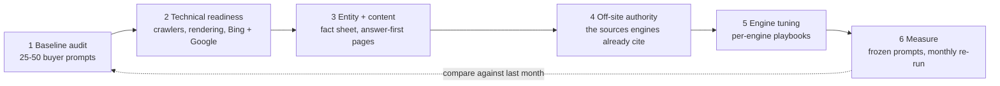

# GEO Visibility

**A Claude skill that audits and improves how your brand is found, cited and recommended in ChatGPT, Claude, Gemini, Perplexity, Microsoft Copilot and Google AI Overviews, while keeping classic SEO strong.**

[](https://github.com/thevibegarage/geo-visibility-skill/releases)
[](https://github.com/thevibegarage/geo-visibility-skill/actions/workflows/tests.yml)
[](LICENSE)
[](CONTRIBUTING.md)

AI engines recommend what they can **retrieve**, **understand** and **trust**. Most brands fail at the first or the last, not at "keywords". This skill diagnoses which, then gives you a repeatable program: a frozen prompt set you re-run monthly, a crawler and rendering check that tests the way each AI agent actually sees your site, and ready-to-ship fixes.

Built and open-sourced by [Garage Labs Technologies](https://www.garagelabstech.com), an AI transformation partner headquartered in India.

## See it work

The readiness checker opens with what to fix, worst first, each with a concrete fix. This is an excerpt of **real, unedited output** on the demo site that ships in this repo, a fictional "Meridian CRM" with flaws planted on purpose ([full file](examples/demo-site-output.md); only the heading level is changed). No real company's site is involved, and you can reproduce it in two commands:

```bash
python3 examples/demo_site.py &
python3 geo-visibility/scripts/check_ai_readiness.py http://127.0.0.1:8765 --paths /pricing /features /blog/crm-for-agencies --issues-only
```

Technical readiness: **71%** (4 failures, 4 warnings)

#### Must fix (8)

| # | Severity | Area | Issue | Detail | Fix |
|---|---|---|---|---|---|
| 1 | fail | access | robots.txt blocks AI or search agents | Claude-SearchBot: blocked on 4/4 tested URLs | Allow Claude-SearchBot in robots.txt if you want AI citations or search visibility. |
| 2 | fail | access | WAF refuses crawler user agents | PerplexityBot: HTTP 403 vs 200 for browser UA (UA-string probe only; real bots also use IP ranges) | Check CDN/WAF bot rules and allowlist verified AI agents. |
| 3 | fail | render | render by agent: /pricing | every agent sees under 150 words, an empty shell for everyone (empty app mount point such as <div id=root>) | Server-render or statically render this page. Test: curl -s <url> shows its own H1 and 300+ words. |
| 4 | fail | schema | JSON-LD present | none | Add Organization/WebSite JSON-LD (assets/schema-templates.md). |
| 5 | warn | render | render by agent: /blog/crm-for-agencies | Googlebot and Bingbot receive different HTML (643 vs 0 words) | Add Bingbot to any crawler allowlist or prerender rule so Bing, and the AI assistants that use its index, see the same page. |
| 6 | warn | indexing | snippet and archive controls | meta robots: nosnippet/max-snippet:0 (Google: also excluded from AI Overviews and AI Mode as direct input; Bing: respected for generative captions) | If this is not a deliberate opt-out, remove it: these directives limit how AI answers can quote or link the page. |
| 7 | warn | discovery | sitemap lastmod honesty | 0/13 stamped today; 13/13 share 2026-03-02. Looks generated or bulk-updated rather than real edit dates. | Emit each page's real updated date, or omit lastmod. |
| 8 | warn | schema | Organization schema | missing on homepage | Add Organization JSON-LD with name, url, logo and sameAs (assets/schema-templates.md). |

It tests the way AI agents see a site, not the way you do. The same run compared the words each agent received without running JavaScript:

| Page | Default fetch | GPTBot | Claude-User | ChatGPT-User | Googlebot | Bingbot | Verdict |
|---|---|---|---|---|---|---|---|
| `/` | 402 | 402 | 402 | 402 | 402 | 402 | pass |
| `/pricing` | 0 | 0 | 0 | 0 | 0 | 0 | fail |
| `/features` | 0 | 521 | 521 | 521 | 521 | 521 | pass |
| `/blog/crm-for-agencies` | 643 | 643 | 643 | 643 | 643 | 0 | warn |

`/features` shows why that matters: a default fetch gets an empty shell, but GPTBot, Claude-User, ChatGPT-User, Googlebot and Bingbot get 521 words, which the checker credits as working dynamic rendering instead of reporting "empty". `/blog/crm-for-agencies` is the opposite gap: Googlebot gets 643 words and Bingbot gets none, the kind of mistake that leaves Copilot blind to a page Google can read. (The prompt-audit side, with mention rates and share of voice, is shown in an [illustrative report](examples/sample-report.md) on the same fictional brand with invented numbers, because it needs the AI engines themselves.)

## Quick start

1. **Install.** Claude web/desktop: download `geo-visibility.skill` from [Releases](../../releases), attach it in a chat and click **Save skill** (needs an org that allows custom skills). Claude Code: copy the `geo-visibility/` folder into `~/.claude/skills/`.
2. **Ask.** *"Why doesn't ChatGPT mention my brand?"* or *"Run an AI visibility audit on example.com."*
3. **Or skip Claude and run the checker yourself** (Python 3.8+, standard library only):

```bash
python3 geo-visibility/scripts/check_ai_readiness.py yourdomain.com --paths /pricing /about --issues-only
```

On macOS with a python.org Python, a `CERTIFICATE_VERIFY_FAILED` result means Python has no root certificates: run `Install Certificates.command` or set `SSL_CERT_FILE=/etc/ssl/cert.pem`.

## How it works



1. **Baseline audit:** 25-50 buyer prompts run across engines, scored for mentions, citations, position and share of voice. The key output is the ranked list of domains the engines actually cite in your category.
2. **Technical readiness:** crawler access (robots.txt, WAF), rendering without JavaScript as each agent sees it (including Googlebot and Bingbot), Bing and Google indexing (Bing Webmaster Tools, IndexNow), snippet and archive controls, structured data, llms.txt.
3. **Entity and content:** a canonical brand fact sheet, answer-first page rewrites, content briefs for every prompt you lose.
4. **Off-site authority:** a ranked, ethical plan for review sites, "best of" lists, press and community presence.
5. **Engine-specific tuning:** per-engine playbooks with confidence levels, including a dedicated [Bing and Microsoft Copilot playbook](geo-visibility/references/bing-copilot.md).
6. **Measurement:** a frozen prompt set, tracker CSV, roll-up script, and a treated-vs-control page experiment.

### What is in the box

| Piece | What it does |
|---|---|
| `scripts/check_ai_readiness.py` | **Must fix** table (failures first, merged per-agent rows, concrete fixes), **Worth checking** list, then every check. Robots rules (wildcards, longest match, group semantics) for AI and search agents, WAF behavior, per-agent rendering, soft 404s, sitemaps (indexes, gzip), JSON-LD, snippet and archive controls, Bing/Google verification hints, IndexNow. `--issues-only`, `--fail-on fail`, JSON output |
| `scripts/score_tracker.py` | Rolls your prompt-run CSV into mention rate, citation rate, share of voice, sentiment mix and a cited-domain list, per engine and per mode (search vs no-search). `--by-stage`, `--domain`, `--compare` for month-over-month deltas. Reads 1/0 or TRUE/FALSE straight from a spreadsheet |
| `references/` | 10 playbooks: engines, Bing/Copilot, prompt audit, technical readiness, content patterns, off-site authority, SEO foundation, verticals, measurement, evidence tiers |
| `assets/` | robots.txt (verified to keep private paths closed for every named bot), llms.txt, JSON-LD templates, tracker CSV, report template |
| `evals/` | 11 test prompts with checkable assertions, plus graded results |

## Run it as a GitHub Action (no Claude needed)

Fork this repo, enable Actions on the fork (GitHub does not run scheduled workflows on forks until you do, and pauses them after 60 days of inactivity), set a `GEO_DOMAIN` repository variable (Settings → Secrets and variables → Actions → Variables), and [the included workflow](.github/workflows/ai-readiness.yml) checks your site every Monday and puts the Must fix table in the run summary. It fails the run if a crawler is refused, the sitemap is missing, a page is `noindex`, or the site is unreachable. Optional variables: `GEO_PATHS` (detail pages to compare across agents) and `GEO_INDEXNOW_KEY`. If your WAF challenges GitHub's datacenter IPs, the run reports "homepage returned HTTP 403" and stops instead of inventing findings.

## Engine and crawler coverage

| Surface | Playbook | Crawler / robots checks | Tracker | First-party data |
|---|---|---|---|---|
| ChatGPT | ✅ | ✅ OAI-SearchBot, ChatGPT-User, GPTBot | ✅ | — |
| Microsoft Copilot / Bing | ✅ [`bing-copilot.md`](geo-visibility/references/bing-copilot.md) | ✅ Bingbot: robots, WAF, Googlebot-vs-Bingbot parity, verification hint, IndexNow | ✅ | Bing Webmaster Tools AI Performance report |
| Claude | ✅ plus a Brave index note | ✅ Claude-SearchBot, Claude-User, ClaudeBot | ✅ | — |
| Gemini / Google AI Overviews | ✅ | ✅ Googlebot, Google-Extended; snippet controls | ✅ | Search Console |
| Perplexity | ✅ | ✅ PerplexityBot, Perplexity-User | ✅ | — |
| Meta AI, Apple, Amazon (Alexa), Mistral, DuckDuckGo | ⚠️ checklist only | ✅ documented tokens, reported as `info` (a business choice) | add by name | — |
| Brave, Grok, DeepSeek, Baidu, Naver, Yandex | ⚠️ pointers only | ❌ | add by name | — |

## What has been tested (and what hasn't)

We believe in shipping honest software. Status as of 2026-10-08:

| Area | Status |
|---|---|
| Crawler/user-agent names (OpenAI, Anthropic, Perplexity, Google) | ✅ Verified against official vendor docs, 2026-10-05 |
| Crawler tokens and user-agent formats for Googlebot, Bingbot (evergreen form), Applebot/Applebot-Extended, Meta (`meta-webindexer`, `meta-externalagent`, `meta-externalfetcher`), Amazon (`Amazonbot`, `Amzn-SearchBot`, `Amzn-User`), MistralAI-User, DuckAssistBot, Google-Extended | ✅ Checked against the vendors' own pages on 2026-10-07; the script reports the non-search ones as `info`. ⚠️ `Bytespider` (ByteDance): no vendor documentation found, from memory |
| Bing/Copilot guidance (`bing-copilot.md`) | ✅ AI Performance report (10 Feb 2026) and its June 2026 additions, and `NOCACHE`/`NOARCHIVE` (22 Sep 2023 post, which says "Bing Chat"), checked against Microsoft's Bing blogs 2026-10-07; IndexNow requirements checked against indexnow.org. ⚠️ Still trade-press only: the four verification methods, the evergreen Bingbot string, "Bing recommends IndexNow over its APIs", "schema helps Microsoft's models" |
| "Claude web search runs on Brave" | ⚠️ Not confirmed. Trade coverage says Anthropic's subprocessor list names Brave Search; Anthropic's own pages could not be read for confirmation on 2026-10-07, and one report says the list also names TurboPuffer for web search. The skill treats it as a hypothesis to test |
| Automated test suite (`python3 -m unittest discover -s tests`, stdlib only, about 3 seconds) | ✅ 173 tests: both scripts, the robots matcher, the shipped robots template, the workflow's exit-code pipeline, the skill build, the demo site and its generated report, the README's links and excerpt. Every v0.1.2 fix has a regression test, and those tests fail against v0.1.1 |
| Per-agent rendering comparison and soft-404 checks in `check_ai_readiness.py` | ✅ Tested on a local mock site that routes by user agent (broken and fixed). ✅ Run on live sites during development, which surfaced a false "Organization schema missing" warning for `EducationalOrganization` and a duplicated homepage finding (both fixed). ✅ Reproducible on the demo site in `examples/`, whose output is regenerated and diffed by a test. ❌ Not yet tested on third-party stacks (WordPress, Next.js, Shopify) |
| Full audit on a real brand (garagelabstech.com, plausible.io) | ✅ Run end-to-end |
| Refusal of manipulative tactics (fake reviews, hidden AI-directed text) | ✅ Tested with fresh agents |
| Head-to-head vs. Claude without the skill | ✅ Run once (see below) |
| Evals 6-11 (Bing/Copilot, snippet controls, robots groups, Brave, tracker, India/Japan) | ✅ Run on 2026-10-07 by sub-agents acting as Claude with the skill installed, graded by hand: 28 of 34 assertions fully met in the latest run of each; the misses are secondary points dropped from short quick answers. Details in [`results-2026-10-07.md`](geo-visibility/evals/results-2026-10-07.md). Single runs, so a smoke test, not a benchmark. Evals 1-5 were not re-run |
| Per-engine behavioral claims (what each engine rewards) | ⚠️ Practitioner reports, hedged in the text — not controlled studies |
| Trigger reliability from natural phrasing | ❌ Not yet tested |
| Multi-month outcome data (does following the plan move citations?) | ❌ Not yet — run your own baseline and re-test monthly |

**Head-to-head result (one run, honestly reported):** on the same brand-visibility task, Claude *without* the skill produced a solid directional report. The skill's edge was process, not magic: a frozen, reproducible prompt set; an inaccuracy log that caught conflicting pricing claims across the web; explicit verified-vs-unverified labeling; a measurement plan with control pages; and ready-to-ship assets (robots.txt, schema, fact sheet). If you want a one-off opinion, any good model will do. If you want a repeatable program you can re-run monthly and defend to a client, that is what this skill adds.

## What this skill will not do

- Promise rankings or citations. AI answers vary by run, user, location and model version.
- Fabricate reviews, statistics or testimonials.
- Write hidden text or prompt-injection content aimed at AI crawlers.
- Undisclosed astroturfing or Wikipedia self-editing.

These refusals are part of the skill's instructions and have been tested.

## Repo layout

```
geo-visibility/
├── SKILL.md                  # entry point: workflow, rules, quick answers
├── references/               # 10 playbooks (engines, Bing/Copilot, prompts, technical,
│                             #   content, off-site, SEO, verticals, measurement, evidence)
├── scripts/                  # readiness checker + tracker roll-up (stdlib only)
├── assets/                   # robots.txt, llms.txt, JSON-LD templates,
│                             #   tracker CSV, report template
└── evals/                    # test prompts with assertions, and graded results
examples/                     # a flawed demo site + the checker's real output on it,
                              #   and an illustrative full report
tests/                        # stdlib unittest suite for the scripts, templates and docs
tools/build_skill.py          # builds dist/geo-visibility.skill
tools/make_demo_report.py     # regenerates examples/demo-site-output.md
```

## Roadmap

- **v0.3** — re-run evals 1-5 and add more; trigger-reliability testing; outcome data from real monthly re-tests; run the checker on WordPress, Next.js and Shopify stacks; confirm or retire the Brave hypothesis; optional API runners for prompt sets (OpenAI web search, Perplexity Sonar, Gemini grounding)
- **Later** — multi-language prompt-audit templates (starting with Hindi/Hinglish); more vertical playbooks from community PRs
- **Ongoing** — crawler and engine-behavior updates as vendors change (open an [engine-update issue](.github/ISSUE_TEMPLATE/engine-update.md) when you spot one)

If this repo saved you time, a ⭐ helps other people find it, which is, fittingly, exactly how GEO works.

## Contributing

PRs welcome, especially engine-behavior updates with sources, new vertical playbooks, and tracker results from real audits. See [CONTRIBUTING.md](CONTRIBUTING.md); run `python3 -m unittest discover -s tests` before opening one. Crawler names and engine behavior change fast; if you spot something stale, open an issue with a link to the vendor doc.

## License

[MIT](LICENSE) © 2026 Garage Labs Technologies. Use it, fork it, build on it. Attribution appreciated but the license only requires keeping the copyright notice.
